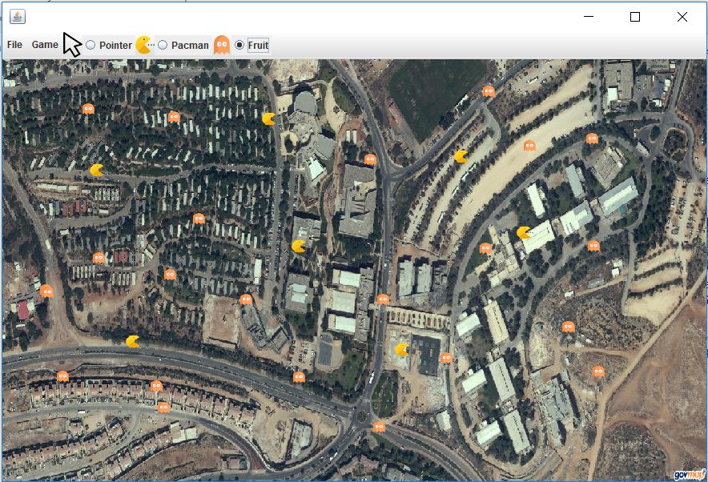

PACMAN
=========
This project represent a game of pacmans in Ariel University area.
Written by: Or Avital And Dana Morhaim

General info
--------
This projace is based on GPS project, wich can be found at <a href="https://github.com/oravital7/Ex2">https://github.com/oravital7/Ex2</a>.

How to play
--------
The player can either import a CSV file or insert by hand pacmans and fruits

The program calculates the fastest routes for each pacman, draws a line of the path, and write the total score of the game

Features
--------
This game includes the following awesome features:

- CSV import - you can save your game as a CSV file

- KML import - you can save your game as a KML file, and watch the routes of pacmans in real life

General info
--------------
Read more in Wiki:
- Geographic coordinate system: https://en.wikipedia.org/wiki/Geographic_coordinate_system
- CSV files: https://en.wikipedia.org/wiki/Comma-separated_values
- KML files: https://en.wikipedia.org/wiki/Keyhole_Markup_Language

&nbsp;
&nbsp;

